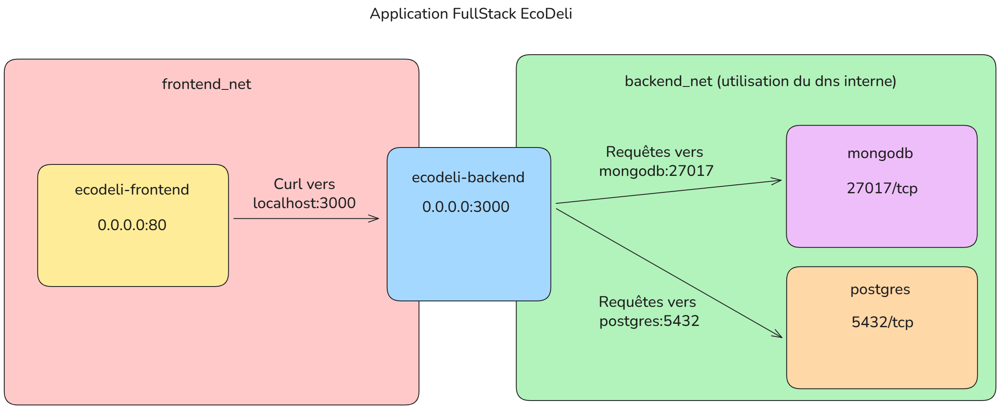

# Déploiement de l’application EcoDeli – Projet Docker

**Rémy THIBAUT – Damien VAURETTE – Quentin DELNEUF**
**Classe : 2A3**

---

## Contexte

Dans le cadre de ce projet, nous avons conteneurisé une application **full stack** que nous avons développée : **EcoDeli**. Cette application se compose :

* **Frontend** : une application développée avec React.
* **Backend** : une API développée avec NestJS.
* **Deux bases de données** : MongoDB (NoSQL) et PostgreSQL (SQL).

La base de données MongoDB est utilisée pour stocker les messages ainsi que les mails.
La base de données PostgrSQL est utilisée pour gérer l'ensemble des autres informations.

> Note : L'application EcoDeli est en cours de développement, nous ne pouvons vous garantir que l'ensemble des fonctionnalités présentes dans l'application conteneurisée fonctionneront.

---


## Architecture Docker

L’architecture repose sur **Docker Compose** et se compose des services suivants :

| Service      | Description                                        | Image DockerHub                                                                               |
| ------------ | -------------------------------------------------- | --------------------------------------------------------------------------------------------- |
| **frontend** | Application React servie par Nginx                 | [remythibaut/ecodeli-frontend\:latest](https://hub.docker.com/r/remythibaut/ecodeli-frontend) |
| **backend**  | API NestJS exposant les endpoints de l’application | [remythibaut/ecodeli-backend\:latest](https://hub.docker.com/r/remythibaut/ecodeli-backend)   |
| **mongodb**  | Base de données NoSQL pour les documents           | [mongo:8.0.9](https://hub.docker.com/_/mongo)                                          |
| **postgres** | Base de données relationnelle                      | [postgis/postgis:17-master](https://hub.docker.com/r/postgis/postgis)                                              |

---

### Images Docker personnalisées

Les images du frontend et du backend ont été poussées sur Docker Hub :

* [remythibaut/ecodeli-frontend](https://hub.docker.com/r/remythibaut/ecodeli-frontend)
* [remythibaut/ecodeli-backend](https://hub.docker.com/r/remythibaut/ecodeli-backend)

Les bases de données n'utilisent pas d'images personnalisées.

---

### Réseaux Docker

Nous avons configuré deux réseaux Docker pour isoler et sécuriser les échanges :

| Réseau         | Utilisé par                | Rôle                                                          |
| -------------- | -------------------------- | ------------------------------------------------------------- |
| `backend_net`  | backend, postgres, mongodb | Communication privée entre le backend et les bases de données, les bases de données ne sont pas exposées sur tout le réseau (0.0.0.0) |
| `frontend_net` | frontend, backend          | Communication du frontend avec le backend, le frontend et le backend sont exposé sur l'ensemble du réseau afin d'être accessible                   |


*Schéma des réseaux Docker de l'application*

> Note : Avec l'utilisation de docker-compose et de l'information **ports**, nous avons fait en sorte que le frontend et le backend soit disponible sur l'ensemble du réseau (0.0.0.0), si nous ne souhaitions pas les exposer, nous aurions du les limiter au réseau frontend_net, et y ajouter un container nginx ou apache pour service de proxy.

---

### Persistance des données

La persistance des données est assurée par des volumes Docker, déclarés dans le fichier `docker-compose.yml` :

```yaml
volumes:
  mongodb_data:
  postgres_data:
```

Ces volumes garantissent la conservation des données même en cas de redémarrage des conteneurs.

---

### Dépendances et démarrage des services

La section **depends_on** et les **healthchecks** permettent d’assurer un démarrage ordonné des conteneurs :

* ✅ Le **backend** attend que PostgreSQL et MongoDB soient sains (dit healthy) avant de démarrer.
* ✅ Le **frontend** attend que le backend soit démarré.

Exemple de configuration :

```yaml
depends_on:
  postgres:
    condition: service_healthy
  mongodb:
    condition: service_healthy
```

---

## Instructions de déploiement

### 1️⃣ Cloner le dépôt

```bash
git clone https://github.com/Objectif20/Partiel-Docker.git
cd Partiel-Docker
```

### 2️⃣ Vérifier les fichiers d’environnement

Les fichiers `.env` (ex. `.env.backend`) doivent être correctement configurés pour les connexions aux bases de données :


```env
MONGO_URL=mongodb://<user>:<password>@mongodb:27017/<db>?authSource=admin
DATABASE_URL=postgres://<user>:<password>@postgres:5432/<db>
```

> Note : Vous pouvez retrouver sur le projet partagé sur MyGES les fichiers de variables d'environnement.

### 3️⃣ Construire et démarrer les services

```bash
docker-compose up --build -d
```

---

## Vérification

Certains containers peuvent prendre quelques secondes pour terminer de démarrer et d'être opérationnel (c'est notamment le cas de Ecodeli-backend qui prend entre 10 et 15 secondes, les bases de données sont démarrées pendant le docker-compose et avant le backend).

* Consulter les logs pour vérifier le bon démarrage :

```bash
docker-compose logs -f
```

* Tester la persistance des données en se connectant aux conteneurs de MongoDB et PostgreSQL.

* Accéder aux applications :

  * Frontend : [http://localhost:80](http://localhost:80) (ou [http://localhost:](http://localhost))
  * Backend : [http://localhost:3000](http://localhost:3000)

Pour tester le backend, vous pouvez vous rendre sur la page [http://localhost:80/deliveries](http://localhost:80/deliveries) afin d'y voir des informations depuis la base de données PostgreSQL.

Pour tester le bon fonctionnement de la base de données MongoDb, vous pouvez effectuer la commande.

```bash 
curl http://localhost:3000/admin/global/mongodb
```

* Vérifier les réseaux créés :

```bash
docker network ls
docker network inspect backend_net
docker network inspect frontend_net
```

Vous devriez voir quelque chose comme ceci :


- **docker network ls**  
  ```bash
    NETWORK ID     NAME              DRIVER    SCOPE
    992f318874cb   backend_net       bridge    local
    06b4f92e411b   frontend_net      bridge    local
  ```

- **docker network inspect backend_net**
  ```json
    [
        {
            "Name": "backend_net",
            "Id": "992f318874cb",
            "Created": "2025-02-21T15:30:01.761863225Z",
            "Scope": "local",
            "Driver": "bridge",
            "IPAM": {
            "Config": [
                {
                "Subnet": "172.23.0.0/16",
                "Gateway": "172.23.0.1"
                }
            ]
            },
            "Containers": {
                "b4585bb4ae24a28ffd9ab8c01fd5f4c81adf7981945635e690f9f8beec63055c": {
                    "Name": "ecodeli-backend",
                    "IPv4Address": "172.23.0.6/16"
                },
                "2fe931722e265322991a7daeb578bfada8fdc5ba544edc60bf9927233a3ee5ae": {
                    "Name": "mongodb",
                    "IPv4Address": "172.23.0.11/16"
                },
                "bfdb1308a849028aa07fc9e0d36fbf34cb934ccff451c42dbe59bca0a20c83d1": {
                    "Name": "postgres",
                    "IPv4Address": "172.23.0.12/16"
                }
            }
        }
    ]
  ```

- **docker network inspect frontend_net**
    ```json
    [
        {
            "Name": "frontend_net",
            "Id": "992f318874cb",
            "Created": "2025-02-21T15:30:01.761863225Z",
            "Scope": "local",
            "Driver": "bridge",
            "IPAM": {
            "Config": [
                {
                "Subnet": "172.24.0.0/16",
                "Gateway": "172.24.0.1"
                }
            ]
            },
            "Containers": {
                "b4585bb4ae24a28ffd9ab8c01fd5f4c81adf7981945635e690f9f8beec63055c": {
                    "Name": "ecodeli-backend",
                    "IPv4Address": "172.24.0.6/16"
                },
                "08865ac3381ee573a43b865a93e1c1aacd9728a664ed4d95ad809c1bcc218574": {
                    "Name": "ecodeli-frontend",
                    "IPv4Address": "172.24.0.5/16"
                },
            }
        }
    ]
    ```

## Build des images personnalisées

Si vous souhaitez effectuer vous-même le build des images personnalisées (Backend et Frontend), vous pouvez les construire vous-même grâce aux Dockerfile présents dans chaque projet.

* Ecodeli-Frontend

  ```bash
  docker build \
    --build-arg VITE_API_BASE_URL=VITE_API_BASE_URL \
    --build-arg VITE_STRIPE_PUBLIC_KEY=VITE_STRIPE_PUBLIC_KEY \
    --build-arg VITE_ONE_SIGNAL_APP_ID=VITE_ONE_SIGNAL_APP_ID \
    -t ecodeli-frontend:latest .
  ```

  Dans une application frontend, les variables d'environnement sont stockées dans les fichiers statiques de l'application après le build (JS) et ne peuvent donc pas être chargées après la création de l'image.


* Ecodeli-Backend

  ```bash
  docker build -t ecodeli-backend:latest .
  ```


## Liens du projet

* **GitHub** (code source et fichiers Docker) :
  [https://github.com/Objectif20/Partiel-Docker.git](https://github.com/Objectif20/Partiel-Docker.git)

* **Docker Hub (images)** :

  * Images personnalisées : 
    * [remythibaut/ecodeli-frontend](https://hub.docker.com/r/remythibaut/ecodeli-frontend)
    * [remythibaut/ecodeli-backend](https://hub.docker.com/r/remythibaut/ecodeli-backend)

  * Images officielles : 
    * [mongo:8.0.9](https://hub.docker.com/layers/library/mongo/8.0.9/images/sha256-93658def16befe2cbccc5cd6019d90474c6484014c8ed12f40e73b866ade3c3e)
    * [postgis/postgis:17-master](https://hub.docker.com/layers/postgis/postgis/17-master/images/sha256-ef35a17f345fb5bd693102c712f677d4e4a3baaccc2b8679f8dd3f0e78acf360)